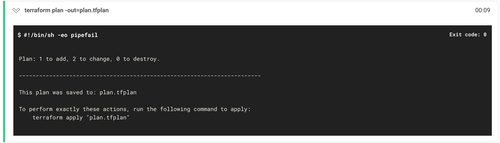
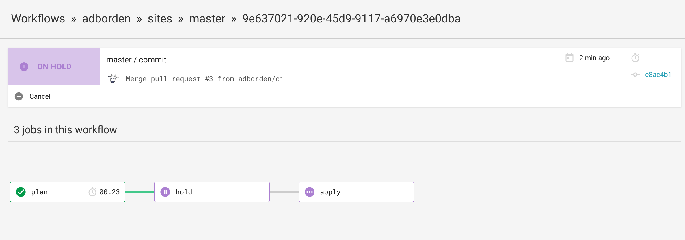
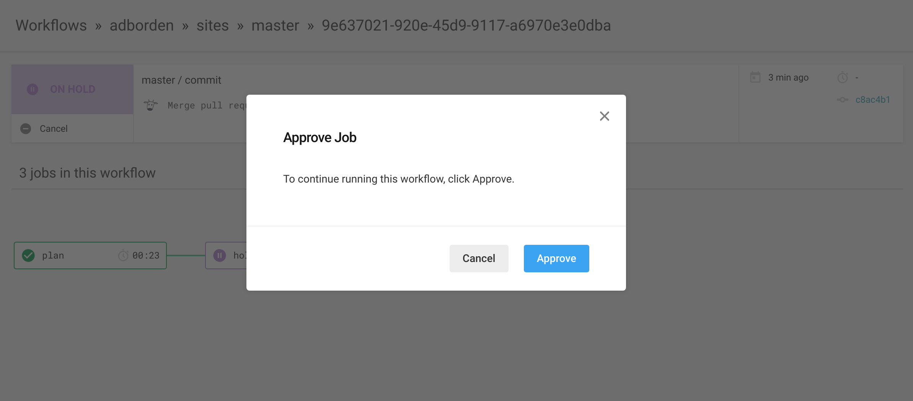
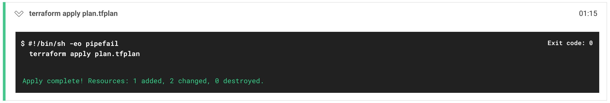

[](https://circleci.com/gh/adborden/sites)

# Terraform static sites

Create static sites hosted on AWS S3 and served by CloudFront.


## How to add a new site

Add something like this to `main.tf`.

```
module "site_example" {
  source = "./modules/site"
  host   = "example"
  zone = "${aws_route53_zone.main.name}"
}
```


## How to push content to the site

Here's an example CircleCi config that you can use to update your static site.

```yaml
version: 2
jobs:
  build:
    docker:
      - image: infrastructureascode/aws-cli
    environment:
      AWS_DEFAULT_REGION=us-west-1
    steps:
    - checkout
    - run: aws s3 cp index.html s3://example.sites.adborden.net/

workflows:
  version: 2
  commit:
    jobs:
      - build:
          context: s3-sites
          filters:
            branches:
              only:
                - master
```

The `context` allows you to share your AWS access key across projects. That
means you can create a single ci-sites-s3-deployer user with only access to push
to your s3 site buckets.


## What it looks like

First, the terraform templates are validated in CI.

Then, CI runs the terraform templates and generates a plan which is saved to the
workspace.



Then the CI waits for manual approval. This is where you should inspect the
generated plan to make sure it's as expected.



Once you've determined the plan is acceptable, you click approve.



Finally, CI continues to apply your plan. If you cancel, the workflow will end
there and you can push a new commit to fix what you didn't like in the plan.




## Bootstraping this project

_Note: this has not been thoroughly tested, yet._

If you're cloning this, or starting from scratch, you need to initialize the S3
bucket used for the terraform back end. This stores the remote terraform state
so that it can be used by your CI/CD setup as well as members of your team.

    $ make bootstrap

Then you'll want create the zone.

    $ make plan
    $ make apply

If you didn't register your domain through Route 53, you probably need to update
your registrar to point to the NS records for your zone to Route 53. e.g.

```
$ dig NS sites.adborden.net

; <<>> DiG 9.11.2-P1 <<>> NS sites.adborden.net
;; global options: +cmd
;; Got answer:
;; ->>HEADER<<- opcode: QUERY, status: NOERROR, id: 53807
;; flags: qr rd ra; QUERY: 1, ANSWER: 4, AUTHORITY: 0, ADDITIONAL: 1

;; OPT PSEUDOSECTION:
; EDNS: version: 0, flags:; udp: 512
;; QUESTION SECTION:
;sites.adborden.net.            IN      NS

;; ANSWER SECTION:
sites.adborden.net.     21599   IN      NS      ns-1456.awsdns-54.org.
sites.adborden.net.     21599   IN      NS      ns-1839.awsdns-37.co.uk.
sites.adborden.net.     21599   IN      NS      ns-205.awsdns-25.com.
sites.adborden.net.     21599   IN      NS      ns-731.awsdns-27.net.
```

## Managing secrets

I use an encfs to store environment variables which get sourced when working on
the project.

    $ source ./env.sh
